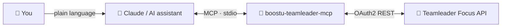

# 🔗 BoostU Teamleader MCP

### The open-source Teamleader Focus MCP server. Manage your CRM from Claude and other AI assistants, in plain language. 🤖

[](https://github.com/boostuagency/boostu-teamleader-mcp/actions/workflows/ci.yml)
[](https://www.npmjs.com/package/boostu-teamleader-mcp)
[](https://www.npmjs.com/package/boostu-teamleader-mcp)
[](https://nodejs.org)
[](https://modelcontextprotocol.io)
[](https://www.npmjs.com/package/boostu-teamleader-mcp)
[](LICENSE)
[](https://boostu.be)

---

## 💡 What is this?

`boostu-teamleader-mcp` is a [Model Context Protocol](https://modelcontextprotocol.io) server that exposes the Teamleader Focus API to AI assistants — including Claude Desktop, Claude Code, Cursor, and Windsurf. It provides over 100 tools spanning the full Teamleader Focus surface: CRM (contacts, companies, deals), sales documents (quotations, invoices, credit notes), product catalog, subscriptions, projects, time tracking, customer-service tickets, and more. Point your AI at it and manage your entire CRM through natural language.

> ### Prefer not to self-host?
> Use the managed, always-on edition at **[teamleader-mcp.boostu.be](https://teamleader-mcp.boostu.be)** — no OAuth setup, magic-link login, and a one-click connector for Claude. Free during the preview, paid plans after.
>
> This repository is the open-source MCP server itself: run it locally with your own Teamleader integration. The hosted edition adds multi-tenant authentication, a dashboard, usage insights, and managed token handling on top of the same server.

| | Self-host (this repo) | Managed ([boostu.be](https://teamleader-mcp.boostu.be)) |
|---|---|---|
| **Price** | Free, MIT-licensed | Free preview, then paid |
| **Setup** | Create your own Teamleader integration, run via `npx` | Copy one connector URL into Claude |
| **Tokens** | You manage `.env` and the refresh token | Encrypted and rotated for you |
| **Best for** | Developers and self-hosters | Non-technical teams

---

## 🔌 How it works



You ask Claude in plain language. Claude calls this MCP server, which authenticates to Teamleader Focus over OAuth2 and runs the matching API call. Your data stays in Teamleader; this server only brokers the calls.

> Use the outline button at the top-right of this file to jump to any section.

---

## ✨ Highlights

- 👥 **Full CRM**: create and update contacts, companies, and deals across all pipelines
- 🧾 **Quotations and invoicing**: create quotations on deals, book invoices into accounting, send by email, and register payments
- 📦 **Product catalog**: browse products, categories, price lists, and units of measure
- 🔁 **Subscriptions**: create, update, and deactivate recurring subscriptions
- 📊 **Projects and time tracking**: manage projects, milestones, log time entries, and start/stop live timers
- 🎫 **Customer-service tickets**: open tickets, post replies, and update statuses
- 🔎 **Reference-data lookups**: resolve deal phases, pipelines, tax rates, payment terms, lost reasons, and more
- 🔐 **OAuth2 with automatic refresh-token rotation**: tokens are refreshed transparently; rotated tokens are persisted to a configurable file
- 🧩 **Selectable tool groups**: load only the groups you need via `TEAMLEADER_TOOLS` to keep your assistant's context lean

---

## 🚀 Quick Start

### Run without installing

```bash
npx boostu-teamleader-mcp
```

### Global install

```bash
npm i -g boostu-teamleader-mcp
boostu-teamleader-mcp
```

### Claude Desktop

Add to `~/Library/Application Support/Claude/claude_desktop_config.json` (macOS) or `%APPDATA%\Claude\claude_desktop_config.json` (Windows):

```json
{
  "mcpServers": {
    "teamleader": {
      "command": "npx",
      "args": ["-y", "boostu-teamleader-mcp"],
      "env": {
        "TEAMLEADER_CLIENT_ID": "your-client-id",
        "TEAMLEADER_CLIENT_SECRET": "your-client-secret",
        "TEAMLEADER_REFRESH_TOKEN": "your-refresh-token"
      }
    }
  }
}
```

### Claude Code

Add to your project's `.mcp.json` or `~/.claude/mcp.json`:

```json
{
  "mcpServers": {
    "teamleader": {
      "command": "npx",
      "args": ["-y", "boostu-teamleader-mcp"],
      "env": {
        "TEAMLEADER_CLIENT_ID": "your-client-id",
        "TEAMLEADER_CLIENT_SECRET": "your-client-secret",
        "TEAMLEADER_REFRESH_TOKEN": "your-refresh-token"
      }
    }
  }
}
```

### Cursor

Add to `.cursor/mcp.json` in your project root (or the global `~/.cursor/mcp.json`):

```json
{
  "mcpServers": {
    "teamleader": {
      "command": "npx",
      "args": ["-y", "boostu-teamleader-mcp"],
      "env": {
        "TEAMLEADER_CLIENT_ID": "your-client-id",
        "TEAMLEADER_CLIENT_SECRET": "your-client-secret",
        "TEAMLEADER_REFRESH_TOKEN": "your-refresh-token"
      }
    }
  }
}
```

### Windsurf

Add to `~/.codeium/windsurf/mcp_config.json`:

```json
{
  "mcpServers": {
    "teamleader": {
      "command": "npx",
      "args": ["-y", "boostu-teamleader-mcp"],
      "env": {
        "TEAMLEADER_CLIENT_ID": "your-client-id",
        "TEAMLEADER_CLIENT_SECRET": "your-client-secret",
        "TEAMLEADER_REFRESH_TOKEN": "your-refresh-token"
      }
    }
  }
}
```

---

## 🔐 Authentication

You need three env vars: `TEAMLEADER_CLIENT_ID`, `TEAMLEADER_CLIENT_SECRET`, and `TEAMLEADER_REFRESH_TOKEN`. Obtain them by registering an integration in the [Teamleader Marketplace / Developer portal](https://marketplace.focus.teamleader.eu) and completing the OAuth2 authorization flow.

Teamleader **rotates the refresh token on every API call**. Set `TEAMLEADER_TOKEN_STORE` to a writable file path so the server can persist the latest token between restarts — without it the token in your config will go stale after the first restart.

For the full step-by-step walkthrough (authorize URL, code exchange, helper scripts) see [docs/AUTHENTICATION.md](docs/AUTHENTICATION.md).

---

## ⚙️ Configuration

### Environment variables

| Name | Required | Description |
|------|----------|-------------|
| `TEAMLEADER_CLIENT_ID` | Yes | OAuth2 client ID from your Teamleader integration |
| `TEAMLEADER_CLIENT_SECRET` | Yes | OAuth2 client secret from your Teamleader integration |
| `TEAMLEADER_REFRESH_TOKEN` | Yes | Initial refresh token obtained from the OAuth2 authorization flow |
| `TEAMLEADER_TOKEN_STORE` | No | Path to a writable file where the server persists the rotated refresh token (e.g. `/var/run/teamleader-token`). Strongly recommended in production. |
| `TEAMLEADER_TOOLS` | No | Comma-separated list of tool group keys to enable. When unset, all 21 groups are loaded. |

### Selective tool groups

Use `TEAMLEADER_TOOLS` to limit which tool groups are registered. This is useful when you want to keep the assistant's tool list small or restrict access to certain areas of Teamleader.

```bash
TEAMLEADER_TOOLS=deals,quotations,products
```

Full list of group keys:

| Key | What it covers |
|-----|---------------|
| `contacts` | Contacts CRUD |
| `companies` | Companies CRUD |
| `deals` | Deals / opportunities |
| `tasks` | Tasks |
| `events` | Calendar events |
| `invoices` | Invoices (create, book, send, pay, download) |
| `quotations` | Quotations (create, update, send, accept) |
| `products` | Product catalog and price lists |
| `reference` | Deal phases, tax rates, payment terms, etc. |
| `org` | Users, teams, departments |
| `customFields` | Custom field definitions |
| `creditNotes` | Credit notes |
| `subscriptions` | Recurring subscriptions |
| `projects` | Projects and milestones |
| `timeTracking` | Time log entries and live timers |
| `activities` | Calls and meetings |
| `tickets` | Support tickets |
| `tags` | Add/remove tags on contacts and companies |
| `notes` | Notes on any subject |
| `files` | File list, download, upload |
| `webhooks` | Webhook registration |

---

## 🧰 Available Tools

### Contacts

| Tool | Description |
|------|-------------|
| `teamleader_list_contacts` | List contacts from Teamleader Focus with optional filtering and pagination |
| `teamleader_get_contact` | Get detailed information about a specific contact |
| `teamleader_create_contact` | Create a new contact in Teamleader Focus |
| `teamleader_update_contact` | Update an existing contact in Teamleader Focus |

### Companies

| Tool | Description |
|------|-------------|
| `teamleader_list_companies` | List companies from Teamleader Focus with optional filtering and pagination |
| `teamleader_get_company` | Get detailed information about a specific company |
| `teamleader_create_company` | Create a new company in Teamleader Focus |

### Deals

| Tool | Description |
|------|-------------|
| `teamleader_list_deals` | List deals/opportunities from Teamleader Focus with optional filtering and pagination |
| `teamleader_get_deal` | Get detailed information about a specific deal |
| `teamleader_create_deal` | Create a new deal/opportunity in Teamleader Focus |
| `teamleader_update_deal` | Update an existing deal in Teamleader Focus |

### Tasks

| Tool | Description |
|------|-------------|
| `teamleader_list_tasks` | List tasks from Teamleader Focus with optional filtering and pagination |
| `teamleader_create_task` | Create a new task in Teamleader Focus |

### Events

| Tool | Description |
|------|-------------|
| `teamleader_list_events` | List calendar events from Teamleader Focus with optional filtering and pagination |
| `teamleader_get_event` | Get detailed information about a specific event |
| `teamleader_create_event` | Create a new calendar event in Teamleader Focus |

### Invoices

| Tool | Description |
|------|-------------|
| `teamleader_list_invoices` | List invoices from Teamleader Focus with optional filtering and pagination |
| `teamleader_get_invoice` | Get detailed information about a specific invoice |
| `teamleader_create_invoice` | Create a new draft invoice in Teamleader Focus |
| `teamleader_invoices_book` | Book a draft invoice into accounting and assign it a number |
| `teamleader_invoices_send` | Send an invoice by email to the specified recipients |
| `teamleader_invoices_register_payment` | Register a payment against an invoice |
| `teamleader_invoices_download` | Get a temporary download URL for an invoice in the specified format |

### Quotations

| Tool | Description |
|------|-------------|
| `teamleader_quotations_list` | List quotations, optionally filtered by deal id |
| `teamleader_quotations_info` | Get a single quotation by id |
| `teamleader_quotations_create` | Create a quotation on a deal, providing one or more line items |
| `teamleader_quotations_update` | Update a quotation's line items |
| `teamleader_quotations_accept` | Accept a quotation (marks it accepted — hard to undo) |
| `teamleader_quotations_send` | Send a quotation by email to the customer |

### Products

| Tool | Description |
|------|-------------|
| `teamleader_products_list` | List products, optionally filtered by search term |
| `teamleader_products_info` | Get a single product by id |
| `teamleader_product_categories_list` | List product categories |
| `teamleader_price_lists_list` | List price lists |
| `teamleader_units_of_measure_list` | List units of measure |

### Reference Data

| Tool | Description |
|------|-------------|
| `teamleader_deal_phases_list` | List deal phases |
| `teamleader_deal_pipelines_list` | List deal pipelines |
| `teamleader_deal_sources_list` | List deal sources |
| `teamleader_lost_reasons_list` | List lost reasons for deals |
| `teamleader_tax_rates_list` | List tax rates |
| `teamleader_payment_terms_list` | List payment terms |
| `teamleader_withholding_tax_rates_list` | List withholding tax rates |

### Organisation

| Tool | Description |
|------|-------------|
| `teamleader_users_list` | List users, optionally filtered by search term |
| `teamleader_users_info` | Get a single user by id |
| `teamleader_users_me` | Get the currently authenticated user |
| `teamleader_teams_list` | List teams |
| `teamleader_departments_list` | List departments |

### Custom Fields

| Tool | Description |
|------|-------------|
| `teamleader_custom_field_definitions_list` | List custom field definitions |
| `teamleader_custom_field_definitions_info` | Get a single custom field definition by id |

### Credit Notes

| Tool | Description |
|------|-------------|
| `teamleader_credit_notes_list` | List credit notes, optionally filtered by invoice or department |
| `teamleader_credit_notes_info` | Get a single credit note by id |

### Subscriptions

| Tool | Description |
|------|-------------|
| `teamleader_subscriptions_list` | List subscriptions, optionally filtered by customer |
| `teamleader_subscriptions_info` | Get a single subscription by id |
| `teamleader_subscriptions_create` | Create a new subscription (starts recurring invoicing for the customer) |
| `teamleader_subscriptions_update` | Update a subscription's title |
| `teamleader_subscriptions_deactivate` | Deactivate a subscription (stops future invoicing) |

### Projects

| Tool | Description |
|------|-------------|
| `teamleader_projects_list` | List projects, optionally filtered by search term or customer |
| `teamleader_projects_info` | Get a single project by id |
| `teamleader_projects_create` | Create a new project for a customer |
| `teamleader_milestones_list` | List milestones, optionally filtered by project |
| `teamleader_milestones_create` | Create a milestone on a project |

### Time Tracking

| Tool | Description |
|------|-------------|
| `teamleader_time_tracking_list` | List time tracking entries, optionally filtered by user |
| `teamleader_time_tracking_add` | Add a time tracking entry |
| `teamleader_time_tracking_update` | Update a time tracking entry's duration or description |
| `teamleader_timer_start` | Start a running timer |
| `teamleader_timer_stop` | Stop a running timer and create a time tracking entry |

### Activities (Calls & Meetings)

| Tool | Description |
|------|-------------|
| `teamleader_calls_list` | List calls, optionally filtered by customer |
| `teamleader_calls_create` | Create a call activity |
| `teamleader_calls_complete` | Mark a call as completed |
| `teamleader_meetings_list` | List meetings |
| `teamleader_meetings_create` | Schedule a meeting |
| `teamleader_meetings_complete` | Mark a meeting as completed |

### Tickets

| Tool | Description |
|------|-------------|
| `teamleader_tickets_list` | List support tickets, optionally filtered by customer or status |
| `teamleader_tickets_info` | Get a single support ticket by id |
| `teamleader_tickets_create` | Create a new support ticket for a customer |
| `teamleader_tickets_update` | Update a ticket's subject or status |
| `teamleader_tickets_add_message` | Add a reply/message to a ticket thread |
| `teamleader_ticket_status_list` | List all available ticket statuses |

### Tags

| Tool | Description |
|------|-------------|
| `teamleader_contacts_add_tags` | Add one or more tags to a contact |
| `teamleader_contacts_remove_tags` | Remove one or more tags from a contact |
| `teamleader_companies_add_tags` | Add one or more tags to a company |
| `teamleader_companies_remove_tags` | Remove one or more tags from a company |

### Notes

| Tool | Description |
|------|-------------|
| `teamleader_notes_list` | List notes linked to a subject (contact, company, deal, etc.) |
| `teamleader_notes_create` | Create a note linked to a subject |

### Files

| Tool | Description |
|------|-------------|
| `teamleader_files_list` | List files linked to a subject (contact, company, deal, etc.) |
| `teamleader_files_download` | Get a temporary download URL for a file by its ID |
| `teamleader_files_upload` | Initiate a two-step file upload and return the upload URL |

### Webhooks

| Tool | Description |
|------|-------------|
| `teamleader_webhooks_list` | List registered webhooks |
| `teamleader_webhooks_register` | Register a webhook URL for the given event types |
| `teamleader_webhooks_unregister` | Unregister a webhook URL for the given event types |

---

## 💬 Example Prompts

```
Create a quotation for deal <id> with two line items: 5 hours of consulting at €150/h and a one-time setup fee of €500.
```

```
Book the draft invoice <id> into accounting and then send it to the customer.
```

```
Register a €1 200 payment against invoice <id> received today via bank transfer.
```

```
Log 2.5 hours on project <id> for user <user_id> with the note "API integration work".
```

```
Start a timer for me right now — I'm working on the BoostU onboarding project.
```

```
Open a support ticket for company <id>: subject "Login not working", priority high.
```

```
What deal phase IDs do we have in pipeline <id>? I need to move deal <id> to the "Proposal sent" phase.
```

```
List all products in the "Hosting" category and their prices.
```

```
Create a monthly subscription for company <id>: product <product_id>, quantity 1, starting next month.
```

```
Show me all open deals with their current phases and tell me which ones haven't moved in the last 30 days.
```

---

## 🐳 Docker

```bash
docker run --rm \
  -e TEAMLEADER_CLIENT_ID=your-client-id \
  -e TEAMLEADER_CLIENT_SECRET=your-client-secret \
  -e TEAMLEADER_REFRESH_TOKEN=your-refresh-token \
  -e TEAMLEADER_TOKEN_STORE=/data/teamleader-token \
  -v /var/run/teamleader:/data \
  ghcr.io/boostuagency/boostu-teamleader-mcp
```

---

## 🛠️ Development

```bash
# Clone and install
git clone https://github.com/boostuagency/boostu-teamleader-mcp.git
cd boostu-teamleader-mcp
npm install

# Run in development mode (no build step required)
npm run dev

# Build
npm run build

# Run tests
npm test

# Type-check only
npm run typecheck
```

---

## 🏗️ Architecture

The core of the server is `createServer` in `src/server.ts`, which is transport-agnostic — it takes a `TeamleaderClient` and registers the enabled tool groups, returning a plain `McpServer` instance that the entry point (`src/index.ts`) wires to a `StdioServerTransport`. Tool logic lives in per-domain modules under `src/tools/`, each following a consistent `try / respond / catch / respondError` pattern using shared helpers in `src/lib/`. OAuth2 token acquisition and rotation are handled entirely in `src/api/auth.ts`, transparent to the rest of the codebase. A hosted, multi-tenant edition of this server is available at [teamleader-mcp.boostu.be](https://teamleader-mcp.boostu.be).

---

## ✅ Endpoint Verification

Most read endpoints (`*.list`, `*.info`) have been live-verified against the Teamleader Focus API. Several write and action endpoints (e.g. `subscriptions.create`, `projects.create`, `files.upload`) are implemented from the official documentation but have not been tested against a live account with the relevant module active. If an endpoint name is wrong, the call will fail with a clear HTTP error message rather than silently misbehaving. The full endpoint manifest and verification status are documented in [docs/teamleader-endpoints.md](docs/teamleader-endpoints.md).

---

## 🤝 Contributing

See [CONTRIBUTING.md](CONTRIBUTING.md) for development setup, commit conventions, and instructions on adding new tool groups.

---

## 🔒 Security

Report security vulnerabilities to **nick@boostu.be** — do not open a public issue. See [SECURITY.md](SECURITY.md) for the disclosure policy. Never commit `.env` files or `.teamleader-token` to version control; both are listed in `.gitignore`.

---

## ⚖️ Disclaimer

This is an independent, community-built integration. It is **not affiliated with, endorsed by, or sponsored by Teamleader NV**. "Teamleader" and "Teamleader Focus" are trademarks of Teamleader NV and are used here only to describe compatibility. You are responsible for your own use of the Teamleader API under Teamleader's terms.

---

## 📄 License

MIT License — Copyright (c) 2026 BoostU Agency. See [NOTICE](NOTICE) for upstream attribution.
